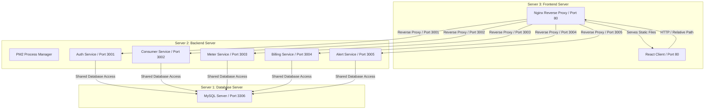

# SmartGrid Utility Management Platform - Deployment Guide

This guide details the step-by-step procedure to deploy the production-ready **SmartGrid Utility Management Platform** across three Ubuntu 22.04 LTS servers. Follow these instructions line-by-line.

---

## SECTION 0 – ARCHITECTURE OVERVIEW

The application is built on a decoupled, three-tier microservices architecture:



### Communication Flow & Ports
1. **Frontend → Backend**: The React client communicates with the Nginx Web Server on the Frontend Server via HTTP (Port 80). Nginx acts as a reverse proxy, routing requests to Server 2 (Backend Server) on Private IP Ports `3001` through `3005` based on sub-routes.
2. **Backend → Database**: Backend microservices connect to Server 1 (Database Server) on Port `3306` using Private IPs.

---

## SECTION 1 – BEFORE YOU START

### Prerequisites
- **Required OS**: Ubuntu 22.04 LTS on all 3 servers.
- **Recommended Specifications**: AWS EC2 `t3.medium` (2 vCPU, 4GB RAM) for Backend/Frontend servers; `t3.small` (2GB RAM) for Database server.
- **Access**: SSH access with Key Pair (`key.pem`) and sudo privileges on all servers.

### Recommended Security Groups Configuration

#### Server 1: Database Server (Private IP: `DB_PRIVATE_IP`)
Configure AWS Security Group inbound rules:
| Protocol | Port Range | Source | Purpose |
| --- | --- | --- | --- |
| TCP | 22 | My IP | Admin SSH Access |
| TCP | 3306 | `BACKEND_PRIVATE_IP`/32 | Allow Backend Service Access |

#### Server 2: Backend Server (Private IP: `BACKEND_PRIVATE_IP`)
Configure AWS Security Group inbound rules:
| Protocol | Port Range | Source | Purpose |
| --- | --- | --- | --- |
| TCP | 22 | My IP | Admin SSH Access |
| TCP | 3001 - 3005 | `FRONTEND_PRIVATE_IP`/32 | Allow Nginx Proxy Routing |

#### Server 3: Frontend Server (Private IP: `FRONTEND_PRIVATE_IP`)
Configure AWS Security Group inbound rules:
| Protocol | Port Range | Source | Purpose |
| --- | --- | --- | --- |
| TCP | 22 | My IP | Admin SSH Access |
| TCP | 80 | 0.0.0.0/0 | Public HTTP Web Access |
| TCP | 443 | 0.0.0.0/0 | Public HTTPS Web Access |

---

## SECTION 2 – CLONE REPOSITORY

You must clone the codebase onto **all three servers**. Execute the following commands on each server after SSH-ing into them:

```bash
git clone https://github.com/your-repo/smartgrid-utility-platform.git
cd smartgrid-utility-platform
```

---

## SECTION 3 – DATABASE SERVER DEPLOYMENT

### Step 3.1: Access the Database Server
SSH into the Database Server (Server 1):
```bash
ssh -i key.pem ubuntu@DATABASE_PUBLIC_IP
cd smartgrid-utility-platform
```

### Step 3.2: Run Database Setup
Make the setup script executable and run it:
```bash
chmod +x scripts/database-install.sh
sudo ./scripts/database-install.sh
```

### Step 3.3: Interactive Script Prompts
The script will prompt you for the following details:
1. `Enter Database Name [smartgrid]:` (Press Enter for default or type your preferred schema name)
2. `Enter Database Username [smartgrid_user]:` (Press Enter or type a custom username)
3. `Enter Database Password [password]:` (Type a strong password and press Enter)

> [!WARNING]
> Save these credentials! You will need them when deploying the Backend Server (Server 2).

### Step 3.4: Verification
Confirm that MySQL is active and running:
```bash
sudo systemctl status mysql
```
Expected output shows `active (running)`.

Verify schema creation by logging in manually:
```bash
mysql -u smartgrid_user -p -h 127.0.0.1
```
*(Enter your database password when prompted)*

Once logged in, run the following SQL commands:
```sql
SHOW DATABASES;
USE smartgrid;
SHOW TABLES;
exit;
```
*(Verify that the database was successfully created. Tables will be empty until the backend migration runs).*

---

## SECTION 4 – BACKEND SERVER DEPLOYMENT

### Step 4.1: Access the Backend Server
SSH into the Backend Server (Server 2):
```bash
ssh -i key.pem ubuntu@BACKEND_PUBLIC_IP
cd smartgrid-utility-platform
```

### Step 4.2: Run Backend Setup
Make the setup script executable and run it:
```bash
chmod +x scripts/backend-install.sh
sudo ./scripts/backend-install.sh
```

### Step 4.3: Interactive Setup Prompts
The script will ask for:
1. `Enter Database Private IP [127.0.0.1]:` Enter the **Private IP of Server 1**.
2. `Enter Database Port [3306]:` Press Enter.
3. `Enter Database Name [smartgrid]:` Enter the database name chosen in Section 3.
4. `Enter Database User [smartgrid_user]:` Enter the username configured in Section 3.
5. `Enter Database Password [password]:` Enter the database password configured in Section 3.
6. `Enter SMTP Host [smtp.mailtrap.io]:` Enter SMTP server address (or press Enter).
7. `Enter SMTP Port [2525]:` Enter SMTP port (or press Enter).
8. `Enter SMTP Username:` Enter SMTP Username (or leave blank to simulate mail logs in console).
9. `Enter SMTP Password:` Enter SMTP Password (or leave blank).
10. `Enter Sender Email [noreply@smartgrid.com]:` Enter sender address.

### Step 4.4: Administrator Interactive Bootstrapping
During execution, the script will run `admin-bootstrap.js` which prompts you to create the initial administrative account:
1. `Enter Admin Name:` Enter your full name.
2. `Enter Admin Email:` Enter a valid admin email address (e.g. `admin@smartgrid.com`).
3. `Enter Admin Password:` Enter a password (minimum 6 characters).

> [!IMPORTANT]
> This is the only way to login to the system. No other sample data is preloaded. Save these login credentials.

### Step 4.5: Verification
Check PM2 processes status:
```bash
sudo pm2 status
```
Expected output:
```
┌────┬─────────────────────────────────┬──────────┬─────────┬────────┬─────────┬────────┬────────┬──────────┬──────────┬──────────┬──────────┐
│ id │ name                            │ mode     │ status  │ ↺      │ cpu     │ mem    │ user   │ watching │ git b... │ uptime   │ [restarts]│
├────┼─────────────────────────────────┼──────────┼─────────┼────────┼─────────┼────────┼────────┼──────────┼──────────┼──────────┼──────────┤
│ 0  │ smartgrid-auth-service          │ fork     │ online  │ 0      │ 0%      │ 32.5mb │ root   │ disabled │ master   │ 10s      │ [0]      │
│ 1  │ smartgrid-consumer-service      │ fork     │ online  │ 0      │ 0%      │ 31.8mb │ root   │ disabled │ master   │ 10s      │ [0]      │
│ 2  │ smartgrid-meter-service         │ fork     │ online  │ 0      │ 0%      │ 32.1mb │ root   │ disabled │ master   │ 10s      │ [0]      │
│ 3  │ smartgrid-billing-service       │ fork     │ online  │ 0      │ 0%      │ 34.0mb │ root   │ disabled │ master   │ 10s      │ [0]      │
│ 4  │ smartgrid-alert-service         │ fork     │ online  │ 0      │ 0%      │ 33.2mb │ root   │ disabled │ master   │ 10s      │ [0]      │
└────┴─────────────────────────────────┴──────────┴─────────┴────────┴─────────┴────────┴────────┴──────────┴──────────┴──────────┴──────────┘
```

Test health check responses locally:
```bash
curl http://localhost:3001/health
curl http://localhost:3002/health
curl http://localhost:3003/health
curl http://localhost:3004/health
curl http://localhost:3005/health
```
Expected output: `{"status":"healthy","service":"...-service"}` for all endpoints.

---

## SECTION 5 – FRONTEND SERVER DEPLOYMENT

### Step 5.1: Access the Frontend Server
SSH into the Frontend Server (Server 3):
```bash
ssh -i key.pem ubuntu@FRONTEND_PUBLIC_IP
cd smartgrid-utility-platform
```

### Step 5.2: Run Frontend Setup
Make the setup script executable and run it:
```bash
chmod +x scripts/frontend-install.sh
sudo ./scripts/frontend-install.sh
```

### Step 5.3: Interactive Prompts
1. `Enter Backend Server Private IP [127.0.0.1]:` Enter the **Private IP of Server 2 (Backend Server)**.

### Step 5.4: Verification
Confirm Nginx is active:
```bash
sudo systemctl status nginx
```
Expected output: `active (running)`.

Verify local HTTP response:
```bash
curl http://localhost | grep -i "smartgrid"
```
Expected output: Returns React HTML boilerplate with title containing `SmartGrid Utility Management Platform`.

---

## SECTION 6 – FIRST LOGIN

1. Open your web browser and navigate to: `http://YOUR_FRONTEND_SERVER_PUBLIC_IP`
2. You will be redirected to the `/login` page.
3. Login using the **Admin credentials** configured in **Step 4.4**.
4. Upon successful validation, you will be routed to the `/admin` Super Admin dashboard.
5. In the Admin Dashboard:
   - Navigate to the **User Accounts** tab.
   - Click **Add System User** to create accounts for **Staff** (e.g., field readers) and **Supervisors** (e.g., inspectors).

---

## SECTION 7 – APPLICATION TESTING CHECKLIST

Follow this sequence to test end-to-end features on your new deploy:

### Test 7.1: Register a Consumer
1. Logout of Admin and go to `http://YOUR_FRONTEND_SERVER_PUBLIC_IP/register`.
2. Register a consumer (Name: John Doe, Email: `john@doe.com`, Address: 123 Power Street).
3. **Expected Result**: Success alert appears, and user is redirected to login. A consumer profile with status `CONNECTED` and balance `$0.00` is initialized in the DB.

### Test 7.2: Provision and Assign Meter (Staff Flow)
1. Login as the **Staff** user created by the Admin.
2. Go to the **Meters & Readings** tab, click **Provision Meter** and add serial `MTR-777`.
3. Go to the **Consumers** tab, click **Assign Meter**. Select consumer `john@doe.com` and meter `MTR-777`.
4. **Expected Result**: Meter status becomes `ACTIVE` and is associated with John Doe.

### Test 7.3: Submit Consumption Readings & Deduct Balance
1. From the Staff Dashboard, go to **Meters & Readings** tab and click **Add Reading**.
2. Select meter `MTR-777` and enter units: `100` kWh.
3. **Expected Result**: Balance is updated. (Since John's balance was `$0.00` and consumption costs `$15.00` (at fallback `$0.15/kWh`), John's balance drops to `-$15.00` and connection status changes to `DISCONNECTED` due to zero balance).
4. Verify notification: John Doe receives a "Service Disconnected" notification in his portal navbar alerts.

### Test 7.4: Consumer Recharge & Service Reconnection
1. Login as Consumer `john@doe.com`.
2. Notice status is `DISCONNECTED` and balance is `-$15.00`.
3. Click **Recharge** and enter amount: `$50.00`.
4. **Expected Result**: Balance updates to `$35.00` (`-$15.00 + $50.00`) and connection status changes to `CONNECTED` (Service Reconnected).

### Test 7.5: Generate Monthly Invoice & Download HTML PDF
1. Login as **Staff**, go to **Billing Logs** tab, and click **Generate Statement**.
2. Select John Doe and enter billing month: `2026-06`.
3. **Expected Result**: Bill is successfully generated. Log back in as Consumer John Doe, navigate to **Billing Statements History**, click the **Download icon** to receive the local HTML invoice receipt.

---

## SECTION 8 – TROUBLESHOOTING

### Issue 8.1: Database Connection Refused
- **Symptoms**: PM2 backend logs show `SequelizeConnectionRefusedError: connect ECONNREFUSED`.
- **Root Cause**: MySQL is only listening on localhost (127.0.0.1) or firewall Port 3306 is blocked.
- **Resolution**:
  1. On Server 1 (Database), check `/etc/mysql/mysql.conf.d/mysqld.cnf` for `bind-address = 0.0.0.0`.
  2. Run `sudo systemctl restart mysql`.
  3. Ensure Server 1 Security Group allows inbound Port 3306 from Server 2 Private IP.

### Issue 8.2: PM2 Services Crashed or Not Running
- **Symptoms**: Services status in `pm2 status` shows `errored` or `stopped`.
- **Root Cause**: Invalid environment variables or missing npm dependencies.
- **Resolution**:
  ```bash
  pm2 logs
  # Check logs for specific module import error
  npm install
  pm2 restart all
  ```

### Issue 8.3: MySQL Access Denied
- **Symptoms**: DB logs show `Access denied for user 'smartgrid_user'@'...'`.
- **Root Cause**: Incorrect user permissions or passwords.
- **Resolution**:
  Log into MySQL on Server 1 as root:
  ```sql
  GRANT ALL PRIVILEGES ON smartgrid.* TO 'smartgrid_user'@'%' IDENTIFIED BY 'password';
  FLUSH PRIVILEGES;
  ```

### Issue 8.4: Nginx Proxy Return 502 Bad Gateway
- **Symptoms**: Browser shows 502 Bad Gateway when accessing `/api/...`.
- **Root Cause**: Backend microservices are not running on Server 2, or backend IP is configured incorrectly in Nginx conf.
- **Resolution**:
  1. Ensure PM2 services are online on Server 2.
  2. Inspect `/etc/nginx/sites-available/smartgrid` on Server 3 to ensure `proxy_pass http://BACKEND_PRIVATE_IP:PORT` points to the correct IP.
  3. Run `sudo systemctl restart nginx`.

---

## SECTION 9 – UPDATE DEPLOYMENT

When pushing codebase updates, use these maintenance scripts:

### Update Backend (Server 2)
```bash
sudo ./scripts/backend-update.sh
```
*Expected Behavior: Pulls git, installs packages, runs schema migrations, and reloads PM2 services with zero downtime.*

### Update Frontend (Server 3)
```bash
sudo ./scripts/frontend-update.sh
```
*Expected Behavior: Pulls git, rebuilds assets, copies to Nginx web root, and reloads configuration.*

### Update Database (Server 1)
```bash
sudo ./scripts/database-update.sh
```
*Expected Behavior: Pulls schema models and executes DB migrations.*

---

## SECTION 10 – UNINSTALL PROCEDURE

To completely remove the application and all dependencies:

### Uninstall Server 1 (Database Server)
```bash
sudo systemctl stop mysql
sudo apt-get purge -y mysql-server mysql-client mysql-common mysql-server-core-* mysql-client-core-*
sudo rm -rf /etc/mysql /var/lib/mysql
```

### Uninstall Server 2 (Backend Server)
```bash
pm2 kill
npm uninstall -g pm2
sudo apt-get purge -y nodejs
```

### Uninstall Server 3 (Frontend Server)
```bash
sudo systemctl stop nginx
sudo apt-get purge -y nginx nginx-common nginx-core
sudo rm -rf /etc/nginx /var/www/smartgrid
```
